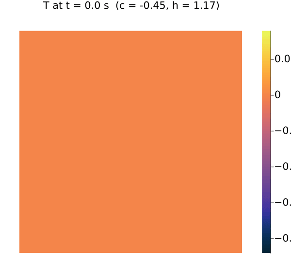

# Algorithms for Real-time Digital Twins

A curated collection of compact, educational algorithms in the [Julia Programming Language](https://julialang.org/) illustrating core numerical methods for real-time digital twins. The collection forms the core of my lecture on *Algorithms for Real-time Digital Twins*. It focuses on dynamical systems, including ordinary and partial differential equations, as well as model order reduction and data-driven discovery modeling. The algorithms are demonstrated through a set of simplified examples. All examples are self-contained, minimal, and designed for classroom use. The emphasis is on simplicity rather than completeness or effectiveness; for example, consistently simple first- or second-order time-stepping schemes are used.

The collection is inspired by the famous *99-line* [2] and *88-line* [3] topology optimization papers, as well as the *Numerical Recipes* series [1]. Many examples are also inspired by [4, 5].

<table>
	<tr>
		<td align="center">
			
			 
			PCB transient thermal simulation
		</td>
		<td align="center">
			
			 
			Lorenz system trajectory
		</td>
	</tr>
</table>

## Repository Structure

- [`algorithms/`](algorithms/) — compact, reusable implementations of the core numerical methods.
- [`models/`](models/) — selected ODE and PDE models used as examples or reference implementations.
- [`scripts/`](scripts/) — runnable examples that demonstrate the algorithms using the selected models.
- [`util/`](util/) — Shared utilities, such as structured grids and data splitting.
- [`tests/`](tests/) — Focused validations for the algorithms and models.
- [`docs/`](docs/) — Detailed explanations, notation, and exercise descriptions.
- [`data/`](data/) — BSON datasets for data-driven discovery (data is not included and needs to be generated by the corresponding [scripts](data/README.md))
- [`exercises/`](exercises/) — Student exercises.

All examples have been tested with [Julia 1.11.6](https://julialang.org/).

## Documentation

For detailed documentation, see the corresponding documents in [docs/](docs/README.md).

## Agentic Software Development
To support agentic software development, for example using GitHub Copilot ([GitHub Education](https://github.com/education/students)), corresponding project guidelines ([`copilot-instructions.md`](.github/copilot-instructions.md)) are included. I recommend trying Copilot to explore the provided algorithms through the exercises or your own examples. Please keep in mind that this does not replace the responsibility of understanding the algorithms in detail, [for the greater good](https://www.nature.com/articles/s44271-026-00402-1).

## Courses
Selected courses in which the examples have been used:
* [*Real-time Algorithms for Digital Twins*](https://www.ukacm-school.uk/) at the UKACM Autumn School 2026 *Beyond Data-Driven Digital Twins: Integrating AI with Computational Mechanics*
*  [*Computational Methods for (Real-time) Digital Twins*](https://moodle.tu-darmstadt.de/course/info.php?id=45801&lang=en) at TU Darmstadt (2025-today)

## References
1. Vetterling, William T. [Numerical recipes example book (c++): The art of scientific computing](https://numerical.recipes/). Cambridge University Press, 2002.
2.  Sigmund, Ole. ["A 99 line topology optimization code written in Matlab."](https://www.topopt.mek.dtu.dk/apps-and-software/a-99-line-topology-optimization-code-written-in-matlab) Structural and multidisciplinary optimization 21.2 (2001): 120-127.
3. Andreassen, Erik, et al. ["Efficient topology optimization in MATLAB using 88 lines of code."](https://www.topopt.mek.dtu.dk/apps-and-software/efficient-topology-optimization-in-matlab) Structural and Multidisciplinary Optimization 43.1 (2011): 1-16. 
4. Steven L. Brunton and J. Nathan Kutz, ["Data-Driven Science and Engineering: Machine Learning, Dynamical Systems, and Control."](https://doi.org/10.1017/9781108380690) Cambridge University Press.
5. Marc Asch, ["A Toolbox for Digital Twins: From Model-Based to Data-Driven."](https://doi.org/10.1137/1.9781611976977) SIAM Mathematics in Industry.

## Contact

Prof. Dr. Dirk Hartmann
TU Darmstadt, ETIT 
Schlossgartenstraße 8 (S2|17) 
64289 Darmstadt

## License
This project is licensed under the MIT License. See [LICENSE](LICENSE).
