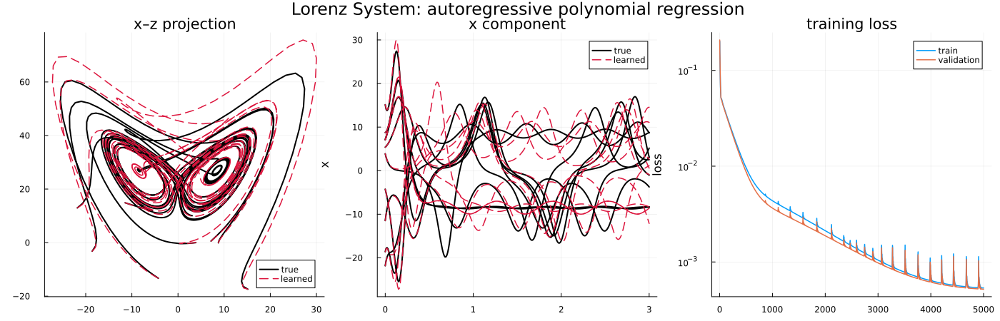

# Machine Learning - Data-driven Dynamical Systems

This document describes a data-driven surrogate approach for dynamicals systems / ordinary differential equation: a neural network that learns the vector field $f_\theta(x) \approx \dot{x}$ from sampled trajectories, then marches it with one explicit Euler step. It builds on the full-order dynamics documented in [ode.md](ode.md) and shares that model's `predict` interface, so the learned model can be rolled out with the same loop as the physical one.

The interesting part is the **training signal**: three comparable scripts learn the same network three different ways, differing only in how the time derivative is supplied, how the loss is formed, or what extra information (the true Jacobian) it is given.

## Contents

- [Motivation and setting](#motivation-and-setting)
- [The model interface](#the-model-interface)
- [The three training schemes](#the-three-training-schemes)
- [Standardisation](#standardisation)
- [Scripts](#scripts)

## Motivation and setting

The flow $\dot{x} = f(x)$ of the dynamical system (see [ode.md](ode.md)) is known here only through data: the ensemble of trajectories produced by [scripts/ode/Lorenz_training_data.jl](../scripts/ode/Lorenz_training_data.jl) and stored in [data/Lorenz_training.bson](../data). We fit a neural network $f_\theta$ to approximate the underlying vector field, so that the learned model can predict new trajectories from unseen initial conditions. Because the training data carries no forcing, the learned field is effectively autonomous; a control input $u$ is still threaded through the interface for consistency with the other models, where it enters as an extra **network input** so the field can respond nonlinearly to it.

The network is a small multilayer perceptron ($(3+3) \to 32 \to 32 \to 3$, `tanh` activations), shared verbatim across the three scripts together with a fixed initialisation seed and architecture. The only thing that changes between scripts is the **derivative label / loss** (and the optimiser's learning rate, tuned per scheme), which is what the comparison is about.

  

## The model interface

[algorithms/ml/NeuralModel.jl](../algorithms/ml/NeuralModel.jl) returns a `NeuralModel` that mirrors the [`ODEModel`](../models/ode/ODEModel.jl) and [`ReducedModel`](../algorithms/rom/ReducedModel.jl) interfaces, it bundles the weights $\theta$ with maps that take $\theta$ explicitly as their first argument:

| Map | Signature | Role |
| --- | --- | --- |
| `rhs` | $(\theta, x, u) \to f_\theta(x, u)$ | the learned vector field, control as input |
| `predict` | $(\theta, x, u, \delta t) \to x + \delta t\,f_\theta(x, u)$ | one explicit Euler step |

`neural_model` builds the MLP and its initial weights; the scripts march the trained model for evaluation by iterating `predict` directly in a short loop. The weights are fitted by one of three training strategies, each in its own file and each returning the trained weights and loss history:

### A second model family - the polynomial vector field

[algorithms/ml/PolynomialModel.jl](../algorithms/ml/PolynomialModel.jl) returns a `PolynomialModel` obeying the **identical** interface, so it is fitted by the very same training functions. It comes in two builders that differ only in the presence of a quadratic term:

$$
\texttt{polynomial\_model\_AC}:\; f_\theta(x, u) = A\,x + C\,u, \qquad
\texttt{polynomial\_model\_AHC}:\; f_\theta(x, u) = A\,x + H\,q(x) + C\,u.
$$

Both carry a **linear** term $A x$ and a **linear control** term $C u$; the AHC model adds a **quadratic** term $H q(x)$ built from the unique degree-two monomials $q(x) = [\,x_i x_j : i \le j\,]$ ($n(n+1)/2$ of them), so the quadratic operator is kept in its symmetric form ($H_{ij} x_i x_j = H_{ji} x_j x_i$, no double counting). The parameters $\theta$ are exactly the entries of the coefficient matrices, bundled as a `ComponentArray`. Because $f_\theta$ is linear in $\theta$, residual training reduces to a linear least-squares fit; and since the Lorenz field is itself linear plus bilinear, the AHC model can reproduce it (near) exactly, no standardisation is needed. The scripts [Lorenz_poly_finitediff.jl](../scripts/ml/Lorenz_poly_finitediff.jl) and [Lorenz_poly_autoregressive.jl](../scripts/ml/Lorenz_poly_autoregressive.jl) build the AHC model and mirror the corresponding neural scripts, differing only in the model they build.

| Function | File | Fits $f_\theta$ by |
| --- | --- | --- |
| `train_model_residual(model, X, Y; …)` | [ResidualTraining.jl](../algorithms/ml/ResidualTraining.jl) | regressing onto derivative estimates `Y` at states `X` |
| `train_model_sobolev(model, X, Y, Jtarget; …)` | [SobolevTraining.jl](../algorithms/ml/SobolevTraining.jl) | regressing onto `Y`, plus the field's own Jacobian onto `Jtarget` |
| `train_model_autoregressive(model, Xseg, δt; …)` | [AutoregressiveTraining.jl](../algorithms/ml/AutoregressiveTraining.jl) | unrolling explicit Euler over trajectory chunks `Xseg` |

All three add an **L2 weight penalty** $\lambda\lVert\theta\rVert^2$ (argument `λ`, default `1e-4`) to their loss, and take the **optimiser as an argument** (`optimizer = OptimizationOptimisers.Adam(1e-3)` by default, or a quasi-Newton `OptimizationOptimJL.LBFGS()`), a per-component weighting `σ`, and a starting point `θ0` (defaulting to `model.params`). `train_model_residual` and `train_model_sobolev` also accept optional control samples `U` (columns aligned with `X`), defaulting to zero for autonomous systems; `train_model_autoregressive` likewise accepts an optional per-step control `Useg` (`nctrl × B × L-1`, one control sample per step transition of every segment in `Xseg`, since different segments generally start at different times), also defaulting to zero. `train_model_sobolev` additionally takes a weight `α` (default `1.0`) on the Jacobian term (`α = 0` recovers `train_model_residual`'s loss exactly) and estimates the model's own Jacobian $\partial f_\theta/\partial x$ by central finite differences of `rhs` (step `ε`, default `1e-4`), mirroring how the derivative label `Y` is itself typically formed from data. Because `θ0` is explicit and the weights are decoupled from the maps, a model trained by one strategy can be handed to another to continue training. Optimisation runs through `Optimization` + `Zygote`.

Each loss is also exposed as a plain function - `residual_loss(model, θ, X, Y; …)`, `sobolev_loss(model, θ, X, Y, Jtarget; …)`, and `rollout_loss(model, θ, Xseg, δt; …)` - used internally to fit the weights but callable directly on any state/label batch. Passing a held-out `Xval, Yval` (or `Xseg_val`, or `Xval, Yval, Jval` for Sobolev) to the training call tracks that same loss at every iteration, without it entering the gradient, and returns it as a **third output** (`θ, history, history_val`); omitting it keeps the original two-output signature (`θ, history`).

## The three training schemes

The finite-difference and Sobolev scripts both call (a variant of) `train_model_residual`; the neural-ODE script calls `train_model_autoregressive`. All three fit the same $f_\theta$; write the finite-difference derivative estimate at sample $x_n$ as $d_n \approx \dot{x}(x_n)$.

**First-order finite difference:** [Lorenz_NN_finitediff.jl](../scripts/ml/Lorenz_NN_finitediff.jl). The label is the forward difference

$$
d_n = \frac{x_{n+1} - x_n}{\delta t} = \dot{x}(x_n) + \mathcal{O}(\delta t),
$$

and the loss is the (scaled) regression residual $\big\lVert f_\theta(x_n) - d_n \big\rVert^2$ averaged over all samples.

**Sobolev (derivative + Jacobian):** [Lorenz_NN_sobolev.jl](../scripts/ml/Lorenz_NN_sobolev.jl). Uses the identical finite-difference label $d_n$, but adds a second term that matches the field's own sensitivity $J_\theta(x_n) = \partial f_\theta/\partial x(x_n)$ against the TRUE Jacobian of the generating system, $J_n = \partial f/\partial x(x_n)$ (evaluated analytically from [models/ode/LorenzSystem.jl](../models/ode/LorenzSystem.jl)):

$$
\big\lVert f_\theta(x_n) - d_n \big\rVert^2 + \alpha \big\lVert J_\theta(x_n) - J_n \big\rVert^2.
$$

This is extra structural information a plain residual fit has no access to; since the data-generating vector field happens to be known here, exploiting its Jacobian tightens the fit from the very same samples. Setting $\alpha = 0$ recovers the finite-difference scheme exactly.

**Neural ODE:** [Lorenz_NN_neuralode.jl](../scripts/ml/Lorenz_NN_neuralode.jl). No derivative label is formed. Instead the model is rolled out with explicit Euler over a horizon of $K$ steps from each segment start $x_s$,

$$
\tilde{x}^{0} = x_s, \qquad \tilde{x}^{k+1} = \tilde{x}^{k} + \delta t\,f_\theta(\tilde{x}^{k}),
$$

and the loss sums the mismatch against the true states along the segment, $\sum_{k=0}^{K} \big\lVert \tilde{x}^{k} - x_{s+k} \big\rVert^2$, backpropagating through every step. Matching a trajectory rather than a pointwise derivative makes the predictor account for its own accumulating step error. A single-step horizon ($K = 1$) would reduce to the first-order scheme up to a factor $\delta t^2$, so the multi-step rollout is what makes this objective genuinely different.

## Standardisation

The tanh layers train better on well-scaled inputs, so the network sees the standardised state $\hat{x} = (x - \mu)\,./\,\sigma$ stacked with the control $u$ and returns the standardised derivative $\dot{\hat{x}}$; `rhs` scales the output back by $\sigma$. The control is appended in physical units (no control statistics are assumed). For a batch (`x` a matrix), `u` may be a single vector (broadcast across the whole batch, for a control shared by every sample) or a matrix with one column per batch entry, for a control that genuinely varies per sample (e.g. a recorded time-varying drive). The per-component statistics $\mu, \sigma$ are computed once from the training states and **folded into the maps as fixed constants**, not trainable weights, keeping the state-space interface in physical units. The losses weight the residual by $1/\sigma$ per component so the three state variables (whose derivative magnitudes differ) contribute comparably.

## Scripts

Each script loads the training trajectories with [`split_trajectories`](../util/DataSplit.jl) into training and validation sets, trains the shared network with its own scheme, and marches the result from a held-out validation initial condition. All figures land in `results/ml/`:

- [Lorenz_NN_finitediff.jl](../scripts/ml/Lorenz_NN_finitediff.jl): first-order forward finite-difference derivative label.

- [Lorenz_NN_sobolev.jl](../scripts/ml/Lorenz_NN_sobolev.jl): the same finite-difference label plus the true Lorenz Jacobian (evaluated from [`lorenz_model`](../models/ode/LorenzSystem.jl)) as a second regression target.

- [Lorenz_NN_neuralode.jl](../scripts/ml/Lorenz_NN_neuralode.jl): unrolls explicit Euler over trajectory chunks (`train_model_autoregressive`) instead of regressing onto a derivative label.

- [Lorenz_poly_finitediff.jl](../scripts/ml/Lorenz_poly_finitediff.jl): repeats the finite-difference recipe for the polynomial `polynomial_model_AHC`.

- [Lorenz_poly_autoregressive.jl](../scripts/ml/Lorenz_poly_autoregressive.jl): repeats the autoregressive recipe for the polynomial model.

