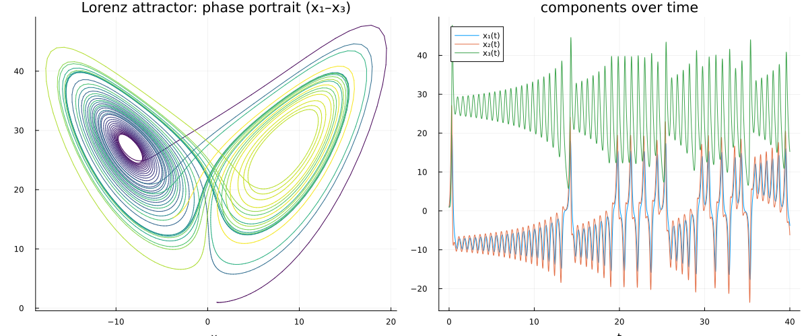
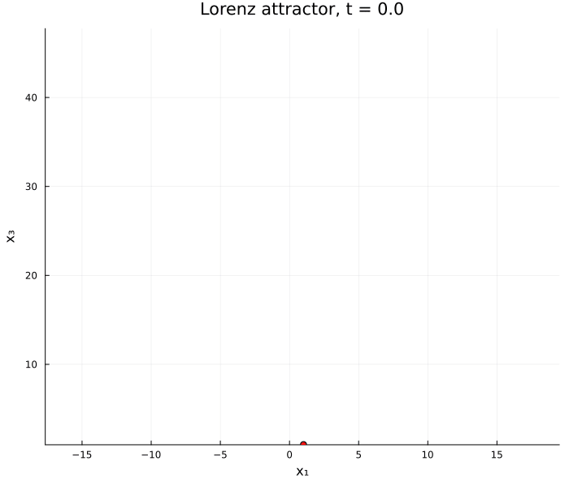
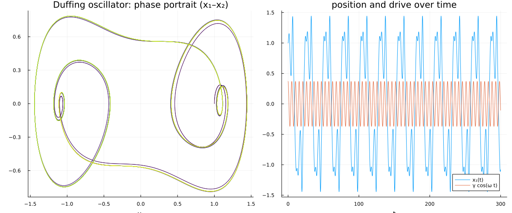
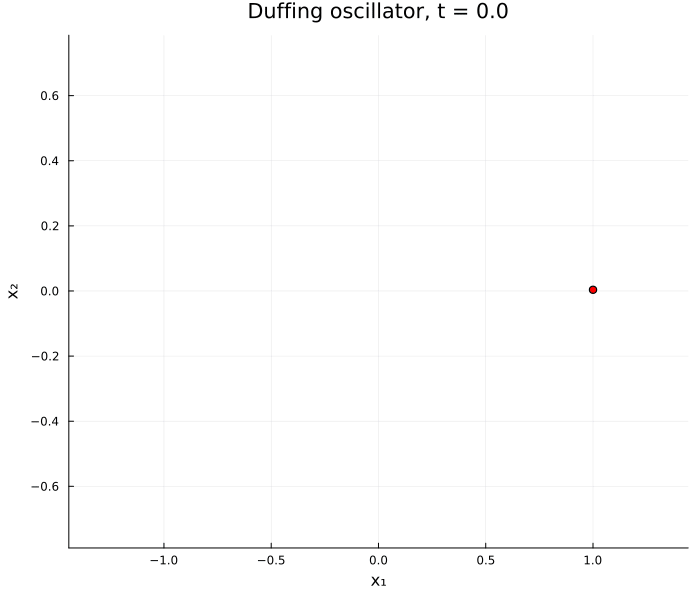
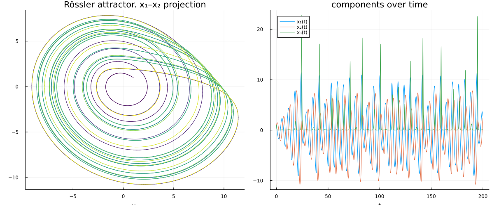
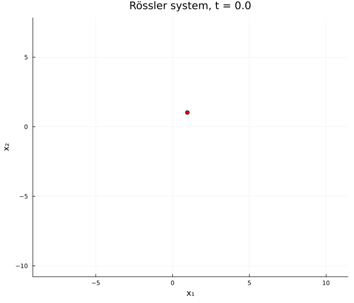

# Ordinary Differential Equations

This document describes the set of nonlinear ordinary differential equations serving as examples. They are compact, chaotic test beds for time stepping and, later, for
data-driven reduced-order models. All of them share a single `ODEModel` interface.

Three systems are included, each a canonical low-dimensional chaotic (or forced-chaotic)
flow:

- the **Lorenz** system - the butterfly attractor,
- the **Duffing** oscillator - a forced double-well oscillator,
- the **Rössler** system - a single-scroll folded-band attractor.

## Contents

- [The model interface](#the-model-interface)
- [ODE models](#ODE-models)
- [Scripts](#scripts)

## The model interface

Every ODE model constructs a shared [`ODEModel`](../models/ode/ODEModel.jl), a small struct
that bundles the physical parameters with three maps:

| Field | Signature | Meaning |
| --- | --- | --- |
| `params` | — | named tuple of the physical parameters (e.g. `(σ, ρ, β)`) |
| `rhs` | `(params, x, u) -> f(x) + u` | the vector field with additive forcing `u` |
| `jacobian` | `(params, x, u) -> ∂f/∂x` | Jacobian of the vector field |
| `predict` | `(params, x, u, δt) -> x(t+δt)` | advance the state `x` by one step of size `δt` |

All three maps take `params` explicitly as their first argument, so every model shares the
exact same signature and can be swapped without changing the calling code. The state vector is
`x` and the forcing/control is `u`, both vary with time. The `jacobian` returns the true
Jacobian `A(x) = ∂f/∂x` of the vector field; `u` is accepted for signature uniformity but,
being additive, does not affect `A(x)`.

### Time stepping

Every model advances with the same **linearly-implicit (Rosenbrock-type) trapezoidal** step:
it freezes the Jacobian at the explicit midpoint predictor $x^* = x^n + \tfrac{\delta t}{2}(f(x^n)+u)$
and solves a single linear system for the increment $x^{n+1}-x^n$,

$$
\Big(I - \tfrac{\delta t}{2}A(x^*)\Big)\,(x^{n+1} - x^{n}) = \delta t\,\big(f(x^{n}) + u\big).
$$

The next state enters only linearly, so each step is one small solve with no Newton iteration.
For a linear field this reduces exactly to Crank–Nicolson (the trapezoidal rule), and freezing
$A$ at the midpoint keeps the scheme second-order accurate.

### Constructing a model

Each model file provides a factory, e.g. [`lorenz_model`](../models/ode/LorenzSystem.jl),
that supplies the classic parameters as keyword defaults and returns the assembled
`ODEModel`:

```julia
model = lorenz_model()                      # classic σ = 10, ρ = 28, β = 8/3
x_next = model.predict(model.params, x, u, δt)
A = model.jacobian(model.params, x, u)      # Jacobian ∂f/∂x at the current state
```

## ODE models

### The Lorenz system

For the state $x = [x_1, x_2, x_3]^\top$ the Lorenz system is

$$
\dot{x}_1 = \sigma\,(x_2 - x_1), \qquad
\dot{x}_2 = x_1\,(\rho - x_3) - x_2, \qquad
\dot{x}_3 = x_1\,x_2 - \beta\,x_3.
$$

With the classic parameters $\sigma = 10$, $\rho = 28$, $\beta = 8/3$ the flow is chaotic and
settles onto the butterfly-shaped **strange attractor**, wandering irregularly between two
lobes without ever repeating. The Jacobian of the vector field is

$$
A(x) = \frac{\partial f}{\partial x} =
\begin{bmatrix}
-\sigma & \sigma & 0 \\
\rho - x_3 & -1 & -x_1 \\
x_2 & x_1 & -\beta
\end{bmatrix}.
$$

<p align="center">
  
  
</p>

### The Duffing oscillator

The Duffing oscillator is a forced nonlinear (double-well) oscillator

$$
\ddot{x} + \delta\,\dot{x} + \alpha\,x + \beta\,x^3 = \text{drive}(t),
$$

written for the state $x = [x_1, x_2]^\top$ (position, velocity) as

$$
\dot{x}_1 = x_2, \qquad
\dot{x}_2 = -\alpha\,x_1 - \beta\,x_1^3 - \delta\,x_2 + u_2,
$$

so the harmonic drive enters through the additive forcing $u = [0,\ \gamma\cos(\omega t)]^\top$
supplied per step by the caller. The cubic stiffness $\beta x_1^3$ differentiates to
$3\beta x_1^2$, so the Jacobian of the vector field is

$$
A(x) = \frac{\partial f}{\partial x} =
\begin{bmatrix}
0 & 1 \\
-(\alpha + 3\beta\,x_1^2) & -\delta
\end{bmatrix}.
$$

For a double well ($\alpha < 0$, $\beta > 0$, defaults $\delta = 0.3$, $\alpha = -1$,
$\beta = 1$) with light damping and a resonant drive the response is chaotic, tracing a
strange attractor in the $(x_1, x_2)$ phase plane.

<p align="center">
  
  
</p>

### The Rössler system

For the state $x = [x_1, x_2, x_3]^\top$ the Rössler system is

$$
\dot{x}_1 = -x_2 - x_3, \qquad
\dot{x}_2 = x_1 + a\,x_2, \qquad
\dot{x}_3 = b + x_3\,(x_1 - c).
$$

With the classic parameters $a = 0.2$, $b = 0.2$, $c = 5.7$ the flow folds onto a
**single-scroll** strange attractor. The only nonlinearity is the bilinear term $x_1 x_3$ in
the last equation, so the Jacobian of the vector field is

$$
A(x) = \frac{\partial f}{\partial x} =
\begin{bmatrix}
0 & -1 & -1 \\
1 & a & 0 \\
x_3 & 0 & x_1 - c
\end{bmatrix}.
$$

<p align="center">
  
  
</p>

## Scripts

Each script rolls its model forward from a point near the attractor, then writes a static
figure (a 2D phase projection coloured by time next to the component time series) and an
animated GIF that traces the state through the phase plane. All outputs land in
`results/ode/`:

- [Lorenz_trajectory.jl](../scripts/ode/Lorenz_trajectory.jl): $x_1$–$x_3$ projection, zero forcing.

- [Duffing_trajectory.jl](../scripts/ode/Duffing_trajectory.jl): $x_1$–$x_2$ phase portrait under the harmonic drive $\gamma\cos(\omega t)$.

- [Roessler_trajectory.jl](../scripts/ode/Roessler_trajectory.jl): $x_1$–$x_2$ projection, zero forcing.

- [Lorenz_training_data.jl](../scripts/ode/Lorenz_training_data.jl): additionally samples 100 Lorenz
trajectories from random initial conditions for the learned models of [ml.md](ml.md).


