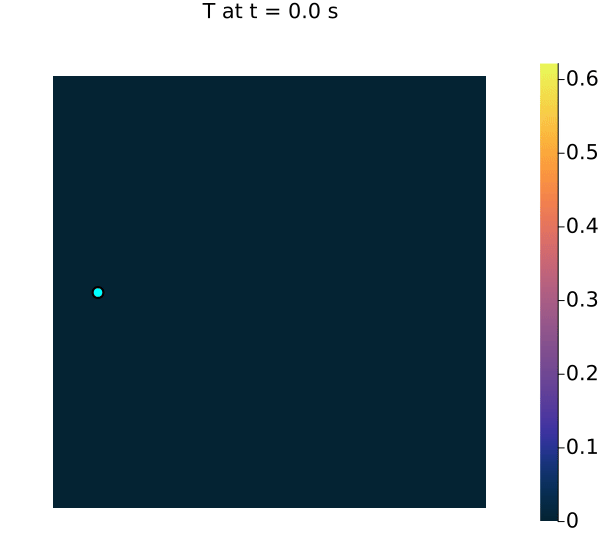

# Partial Differential Equations

This document describes the partial differential equations in this collection. They serve as compact, spatially-discretised test beds for time stepping and, later, as full-order models for reduced-order and data-driven methods. All of them share a single `PDEModel` interface.

Two models are included, both governed by the isotropic heat equation on the unit square:

- the **PCB thermal** model: heat conduction on a printed-circuit-board geometry with localised heating and cooling, assembled by either finite elements (FE) or finite volumes (FV),
- the **SLM thermal** model: selective-laser-melting heat conduction with a moving Gaussian laser spot and linear dissipation.

## Contents

- [The model interface](#the-model-interface)
- [PDE models](#pde-models)
- [Structured grid and numbering](#structured-grid-and-numbering)
- [Finite element discretisation](#finite-element-discretisation)
- [Finite volume discretisation](#finite-volume-discretisation)
- [Boundary conditions](#boundary-conditions)
- [Material and source fields (from images)](#material-and-source-fields-from-images)
- [Scripts](#scripts)

## The model interface

Every PDE model constructs a shared [`PDEModel`](../models/pde/PDEModel.jl), a small struct that bundles the physical parameters with four maps:

| Field | Signature | Meaning |
| --- | --- | --- |
| `params` | — | named tuple: grid, assembled operators `M`, `K`, load-distribution patterns, boundary data, and a step cache |
| `load` | `(params, u) -> load` | assemble the nodal load vector from the forcing `u` |
| `rhs` | `(params, T, u) -> -K·T + load(u)` | the semi-discrete field $M\,\dot T = -K\,T + \text{load}(u)$ |
| `jacobian` | `(params, T, u) -> ∂rhs/∂T` | Jacobian of the field, $-K$ |
| `predict` | `(params, T, u, δt) -> T(t+δt)` | advance the state `T` by one implicit step of size `δt` |

All four maps take `params` explicitly as their first argument, so every model shares the exact same signature and can be swapped without changing the calling code. The state is the nodal temperature vector `T` and the forcing/control is `u`, both vary with time. Spatial discretisation (FE or FV) turns the heat equation into the semi-discrete system

$$
M\,\dot{T}(t) = -K\,T(t) + \text{load}\big(u(t)\big),
$$

with mass matrix $M$ and the symmetric positive-semidefinite conductivity (stiffness) matrix $K$. Because the field is linear in $T$, the `jacobian` returns the constant matrix $-K$.

### Time stepping

Every model advances with the same **implicit Euler** step. Freezing the forcing at the new time and moving the state to the left gives one linear solve per step,

$$
\big(M + \delta t\,K\big)\,T^{n+1} = M\,T^{n} + \delta t\,\text{load}\big(u^{n+1}\big).
$$

Since $M$ and $K$ are constant, the step matrix depends only on $\delta t$: it is factorised **once per step size** and reused while only the right-hand side changes each step. The PCB model additionally imposes Dirichlet data by symmetric elimination, caching the constrained factorisation per $\delta t$ in `params.cache`; only the right-hand side is constrained anew on each step.

### Constructing a model

Each model file provides a factory, [`pcb_thermal_model`](../models/pde/PCB_thermal.jl) and [`slm_thermal_model`](../models/pde/SLM_thermal.jl), that assembles the operators from the cell-wise fields and returns the completed `PDEModel`:

```julia
g = Grid(nelx, nely)                                            # structured grid on [0,1]²
model = pcb_thermal_model(g, field_κ, field_s_c, field_s_h;     # FE by default
                          bc = (left = 0.0, right = 0.0))       # Dirichlet T = 0 on left/right
T_next = model.predict(model.params, T, (c, h), δt)            # one implicit-Euler step
A = model.jacobian(model.params, T, u)                         # Jacobian of the field, -K
```

The FE / FV choice is a keyword: `pcb_thermal_model(…; assemble = assemble_fvm_matrices, load_distribution = assemble_fvm_load_distribution)` selects the finite volume assembly, and both discretisations share the node numbering so their solution vectors are directly comparable.

## PDE models

### The PCB thermal model

The PCB model is the transient, isotropic heat equation with a position-dependent conductivity field $\kappa(x,y)$ and separable heating / cooling sources,

$$
\partial_t T(t,x,y) = \nabla\cdot\big(\kappa(x,y)\,\nabla T(t,x,y)\big)
    + s_c(x,y)\,c(t) + s_h(x,y)\,h(t),
$$

on the non-dimensional domain $[0,1]\times[0,1]$. The spatial masks $s_c, s_h : \Omega \to [0,1]$ localise cooling and heating; the scalars $c(t)$ and $h(t)$, supplied per step as the forcing $u = (c, h)$, drive them in time. Spatial discretisation gives the semi-discrete system

$$
M\,\dot{T}(t) = -K\,T(t) + s_c\,c(t) + s_h\,h(t),
\qquad \text{load}(u) = s_c\,u_1 + s_h\,u_2,
$$

so the field Jacobian is the constant matrix $A = -K$. Dirichlet data (by default $T = 0$ on the left and right edges) is carried in `params.bc`; every other edge stays zero-Neumann (insulated). The **stationary** problem solved by the comparison script drops the time derivative,

$$
K\,T = s_c\,c + s_h\,h,
$$

subject to the chosen Dirichlet data.

<p align="center">
  
</p>

### The SLM thermal model

The SLM model reuses the same FE assembly but replaces the static masks with a **moving Gaussian laser** and adds **linear dissipation** to an ambient temperature of 0 (every edge stays zero-Neumann, so no boundary term is imposed):

$$
\partial_t T = \nabla\cdot(\kappa\,\nabla T) + q(t,x,y) - \beta\,T,
\qquad
q(t,x,y) = \frac{p}{2\pi w^2}\,
\exp\!\Big(-\frac{(x-x_0(t))^2 + (y-y_0(t))^2}{2 w^2}\Big),
$$

with spot power $p$, radius $w$, and centre $(x_0(t), y_0(t)) = (x_0 + v_x t,\, y_0 + v_y t)$ supplied as the forcing $u = (x_0, y_0)$. Folding the dissipation $\beta M$ into the conductivity operator, the semi-discrete system is

$$
M\,\dot{T}(t) = -(K + \beta M)\,T(t) + q(t),
$$

so the field Jacobian is $A = -(K + \beta M)$. The nodal load $q(t)$ is re-assembled from the moving cell-wise Gaussian field ([`gaussian_distribution_field`](../models/pde/SLM_thermal.jl)) at each step; constant conductivity and the constant step matrix mean its factorisation is reused across the scan.

<p align="center">
  
</p>

## Structured grid and numbering

The mesh covers $[0,1]^2$ with `nelx` × `nely` square cells of equal edge length $\delta x = 1/\texttt{nelx}$, with the same spacing in both directions ($\delta x = \delta y$). Nodes form a `nx` × `ny` lattice with `nx = nelx + 1` and `ny = nely + 1`.

Both the FE and FV unknowns live on the **same vertex lattice**, so their solution vectors are directly comparable node-by-node. The material and source fields are supplied **per cell** (one pixel = one cell).

### Node numbering

Nodes are numbered **column-major with the y-index running fastest**. For a node at column `ix` (1…`nx`) and row `iy` (1…`ny`):

$$
\texttt{node\_id}(ix, iy) = (ix - 1)\cdot \texttt{ny} + iy.
$$

The top-left corner is `(ix, iy) = (1, 1)`; `iy` increases downward.

```
        ix = 1     ix = 2     ix = 3          node ids (nelx = nely = 2):
       (col 1)    (col 2)    (col 3)
iy=1     o----------o----------o               1 ---- 4 ---- 7     <- iy = 1 (top)
 |       |          |          |               |      |      |
 |       |   e(1,1) |   e(2,1) |               2 ---- 5 ---- 8     <- iy = 2
 v       o----------o----------o               |      |      |
         |          |          |               3 ---- 6 ---- 9     <- iy = 3 (bottom)
         |   e(1,2) |   e(2,2) |
         o----------o----------o             ids increase down each column,
                                             then jump to the next column.
```

Consequences of this ordering:

- The 5-point / element couplings connect ids differing by `1` (vertical neighbour) and by `ny` (horizontal neighbour) so $K$ is **banded** with half-bandwidth $\approx$ `ny`. This is the classic natural ordering.
- Sparse direct solves via `A \ b` (SuiteSparse) apply their own fill-reducing permutation, so this input ordering is chosen for clarity rather than to optimise the factorisation.

### Element numbering and local node order

Element `(elx, ely)`, with `elx` = 1…`nelx` and `ely` = 1…`nely`, occupies the cell in column `elx`, row `ely`. Its four corner nodes are listed in the local order **[TL, TR, BR, BL]** (top-left, top-right, bottom-right, bottom-left):

```
   local node order for element (elx, ely)

     n1 = (elx-1)*ny + ely            n2 = elx*ny + ely
        (TL) o──────────────────────o (TR)
             │                        │
             │      element           │
             │      (elx, ely)        │
             │                        │
        (BL) o──────────────────────o (BR)
     n1+1 = (elx-1)*ny + ely+1        n2+1 = elx*ny + ely+1

   edof = (n1, n2, n2+1, n1+1) = (TL, TR, BR, BL)
```

This is implemented by `element_nodes(g, elx, ely)` in [util/StructuredGrid.jl](../util/StructuredGrid.jl). The cell field is indexed `field_κ[ely, elx]`, a `(nely × nelx)` matrix, matching both the image layout and the element loop.

### Boundary node lists

Helper functions return the node ids along each side, ordered along that side:

- `left_nodes` / `right_nodes`: length `ny`, ordered top → bottom.
- `top_nodes` / `bottom_nodes`: length `nx`, ordered left → right.

These define the ordering expected for boundary value vectors (see [Boundary conditions](#boundary-conditions)).

## Finite element discretisation

The FE assembly ([models/pde/thermal_FEM.jl](../models/pde/thermal_FEM.jl)) uses bilinear Q1 elements (also called Q4 for their 4 nodes) and builds the global matrices from fixed element matrices scaled per cell.

### Element matrices

On a square cell of side $\delta x$ with bilinear shape functions:

- **Conductivity (Laplacian) matrix** - independent of $\delta x$; scaled by the cell
  conductivity $\kappa$ during assembly:

  $$
  K_e = \frac{1}{6}
  \begin{bmatrix}
   4 & -1 & -2 & -1 \\
  -1 &  4 & -1 & -2 \\
  -2 & -1 &  4 & -1 \\
  -1 & -2 & -1 &  4
  \end{bmatrix}.
  $$

- **Consistent mass matrix**:

  $$
  M_e = \frac{\delta x^2}{36}
  \begin{bmatrix}
  4 & 2 & 1 & 2 \\
  2 & 4 & 2 & 1 \\
  1 & 2 & 4 & 2 \\
  2 & 1 & 2 & 4
  \end{bmatrix}.
  $$

- **Source vector** - the integral of each shape function over the cell:
  $f_e = \tfrac{\delta x^2}{4}\,[1,1,1,1]^\top$.

### Assembly

The matrices and the right-hand side are assembled by **separate functions**. `assemble_fem_matrices(g, field_κ)` loops over elements and scatters the local matrices into COO triplets using the element connectivity `edof`:

$$
K \mathrel{+}= \kappa_{ely,elx}\,K_e, \qquad M \mathrel{+}= M_e,
$$

forming the global $K$ and $M$ with `sparse(I, J, V, ndof, ndof)`. A cell-wise source field is turned into a nodal vector by `assemble_fem_load_distribution(g, field)`:

$$
s[\text{edof}] \mathrel{+}= \text{field}_{ely,elx}\,f_e,
$$

which the scripts call once per drive to build $s_c$ and $s_h$. Because no boundary term is added, the natural boundary condition is homogeneous Neumann; $K$ is the assembled symmetric positive-semidefinite stiffness matrix.

## Finite volume discretisation

The FV assembly ([models/pde/thermal_FVM.jl](../models/pde/thermal_FVM.jl)) is a **vertex-centred, second-order 5-point finite volume scheme** sharing the FE node numbering and unknowns. Its control-volume form makes variable conductivity and the zero-Neumann boundary fall out naturally.

### Stencil and face conductivities

Each interior node exchanges flux with its four axis-aligned neighbours. The conductance across an edge equals the **face conductivity**, obtained by averaging the cell field over the (one or two) cells adjacent to that edge:

```
                 (ix, iy-1)
                     │  κ_N          κ_N = mean of cells above the vertical edge
                     │
   (ix-1,iy) ──κ_W──(ix,iy)──κ_E── (ix+1,iy)
                     │
                     │  κ_S
                 (ix, iy+1)
```

For a horizontal (x-) edge between nodes `(ix,iy)` and `(ix+1,iy)`, the adjacent cells are the ones directly above (`iy-1`) and below (`iy`); their conductivities are averaged. Vertical (y-) edges are handled analogously with the left / right cells. In 2D the mesh size cancels, so each edge contributes a scalar conductance $\kappa_\text{face}$ to the symmetric graph-Laplacian pattern:

$$
K[P,P] \mathrel{+}= \kappa,\quad
K[Q,Q] \mathrel{+}= \kappa,\quad
K[P,Q] = K[Q,P] \mathrel{-}= \kappa.
$$

Edges that would leave the domain are simply **omitted**, which is exactly the discrete homogeneous Neumann (zero-flux) condition, no special-casing needed.

### Lumped mass and sources

`assemble_fvm_matrices(g, field_κ)` builds $K$ from the face conductivities and the diagonal mass matrix $M$ from **quarter-cell areas** ($A_4 = \delta x^2/4$ per adjacent cell). `assemble_fvm_load_distribution(g, field)` lumps a cell-wise source the same way, adding $A_4$ of each cell's value to its four corner nodes; this makes the FV source vectors **identical** to the FE consistent-source vectors.

## Boundary conditions

Dirichlet conditions are imposed by `impose_dirichlet` ([models/pde/DirichletBC.jl](../models/pde/DirichletBC.jl)) using symmetry- preserving elimination, split into two independent maps that share the same per-side spec:

1. Collect the prescribed values per side. Each side is either `nothing` (keep the default zero-Neumann) or a value given as a **scalar** or a **vector** ordered along that side (length `ny` for left/right, `nx` for top/bottom). Shared corners take the value of the last side that specifies them.
2. `impose_dirichlet(A, g; …)` zeroes the constrained rows and columns of the matrix and sets a unit diagonal, returning `(A, fixed)`.
3. `impose_dirichlet(b, A, g; …)` moves the known columns of the **original** `A` to the right-hand side ($b \mathrel{-}= A[:, d]\,x_d$) and writes $b_d = x_d$, returning `(b, fixed)`.

Because the matrix map is independent of `b`, a transient solver constrains and factorizes `A` **once** per step size and reuses the factorization while only the right-hand side is constrained anew each step (see `pcb_predict` in [models/pde/PCB_thermal.jl](../models/pde/PCB_thermal.jl)). Both maps work identically for the FE and FV matrices because they share the numbering. Any side left as `nothing` remains insulated (zero Neumann).

## Material and source fields (from images)

The cell-wise fields are read directly from grayscale PNGs in the script with `Float64.(Gray.(load(path)))` (from `Images`), giving `(nely × nelx)` matrices of values in $[0,1]$ (one pixel = one cell); the mesh resolution follows from the image size.

The input geometries are `models/data/PCB_geometry_k.png` (conductivity $\kappa$), `models/data/PCB_geometry_c.png` (cooling mask $s_c$) and `models/data/PCB_geometry_h.png` (heating mask $s_h$).

## Scripts


- [PCB_stationary.jl](../scripts/pde/PCB_stationary.jl): Solves the **stationary** PCB problem with both discretisations and compares them. Cooling is driven with $c = -1$ and heating with $h = +1$; Dirichlet $T = 0$ is applied on the **left and right** edges while top and bottom stay zero-Neumann.

- [PCB_transient.jl](../scripts/pde/PCB_transient.jl): The evolving field is written as an animated GIF `results/pde/PCB_transient.gif`. Unlike `PCB_training_data.jl`, this script does not persist a BSON dataset; the reduced-order model scripts ([rom.md](rom.md)) instead reuse `data/PCB_training.bson`.

- [PCB_training_data.jl](../scripts/pde/PCB_training_data.jl): Generates a **training dataset** of transient PCB fields for data-driven algorithms. Ten transients share the same geometry, grid and implicit-Euler time stepping as `PCB_transient.jl`, but each is driven by a **fresh pair of random** cooling / heating signals $c(t)$, $h(t)$. 

- [SLM_transient.jl](../scripts/pde/SLM_transient.jl): Integrates the **transient SLM** system $M\,\dot T = -(K + \beta M)\,T + q(t)$ over a scan window, starting from $T = 0$. A Gaussian laser spot of fixed power and width travels across the domain at constant velocity. 

- [PCB_benchmark.jl](../scripts/pde/PCB_benchmark.jl):  Benchmarks linear solvers on the **stationary** FE system $K\,T = s_c\,c + s_h\,h$ (Dirichlet $T = 0$ on the left/right edges), timing each on the very same system. It compares direct factorisations (sparse backslash reference, LU / UMFPACK, Cholesky / CHOLMOD, QR / SPQR) against `Krylov.jl` iterative solvers (`cg`, `gmres`) each paired with a few preconditioners (none, Jacobi, incomplete LU, algebraic multigrid). 
