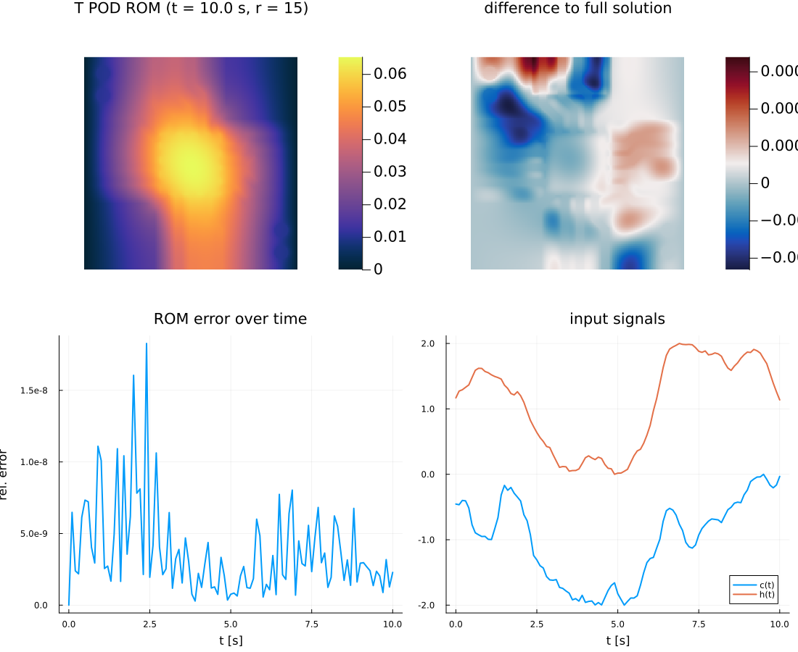

# Reduced-Order Modelling

This document describes the concept of reduced-order modelling (ROM) as applied to the example of the transient PCB heat problem, i.e., a simple linear time-invariant setting however not restricted to it. It builds on the full-order discretisation documented in [pde.md](pde.md).

## Contents

- [Motivation and setting](#motivation-and-setting)
- [The reduced-model interface](#the-reduced-model-interface)
- [Dimension reduction](#dimension-reduction)
- [Dimension + model reduction](#dimension--model-reduction)
- [Scripts](#scripts)

## Motivation and setting

Spatially discretising the heat equation (see [pde.md](pde.md)) yields the semi-discrete, linear time-invariant (LTI) system

$$
M\,\dot{x}(t) = -K\,x(t) + B\,u(t),
\qquad B = [\,s_c \;\; s_h\,], \quad u(t) = [\,c(t) \;\; h(t)\,]^\top,
$$

with the nodal temperature $x$ of dimension $n = n_x n_y$. For real-time digital twins the full state is too large to evaluate repeatedly, so we seek a **reduced model** whose state lives in an $r$-dimensional subspace ($r \ll n$),

$$
x(t) \approx V\,z(t), \qquad V \in \mathbb{R}^{n\times r}, \; V^\top V = I,
$$

that reproduces the input–output behaviour at a fraction of the cost. The algorithms presented here differ in **how the reduced basis $V$ is chosen** as well as **how the reduced dynamic model in $V$ is obtained**.

  

## The reduced-model interface

[algorithms/rom/ReducedModel.jl](../algorithms/rom/ReducedModel.jl) defines the shared `ReducedModel` returned by every ROM, it holds **only** the struct. It bundles a set of `params` with three maps that all take those parameters **explicitly** as their first argument:

| Map | Signature | Role |
| --- | --- | --- |
| `encode` | `(params, x) -> z` | full state (or time series) $\to$ reduced coordinates |
| `decode` | `(params, z) -> x` | reduced coordinates $\to$ full state (or time series) |
| `predict` | `(params, z, u, δt) -> z₊` | one implicit-Euler step of size $\delta t$ |

Keeping the parameters in a separate argument is deliberate: for the projection ROMs `params` holds the basis $V$ and the reduced operators, but the same interface carries over to a **learned** reduction where `params` instead holds neural-network weights and `encode` / `decode` form an autoencoder. Both `encode` and `decode` act column-wise, so they map a single state (a length-$n$ vector) or a whole **time series** (an $n\times T$ matrix of column states) in one call. The time step is passed to `predict` explicitly, so a model can be marched with varying step sizes. Each ROM **constructs its own** `ReducedModel`.

### The dimensionality-reduction interface

[algorithms/rom/DimReduction.jl](../algorithms/rom/DimReduction.jl) defines the companion `DimReduction` struct, the same interface **without** `predict`. A reduction only maps between the full and reduced spaces and never advances the state in time, so it bundles `params` with just `encode` and `decode`. The linear POD reduction ([POD-Reduction.jl](../algorithms/rom/POD-Reduction.jl), `params` holds the basis $V$) and the learned POD-autoencoder ([AE-POD-Reduction.jl](../algorithms/rom/AE-POD-Reduction.jl), `params` holds encoder/decoder weights) both construct a `DimReduction`, so they can be swapped and compared mode for mode.

### Reduced time integration

The predictor advances the reduced state by one **Euler** step of the requested size $\delta t$. The comparison scripts inline this rollout: they encode the initial full state $x_0$, roll `predict` forward over `ts`, and decode the whole reduced trajectory back to the full space in a single `decode` call, returning an $n\times T$ matrix. Thereby, the full-order **reference** is not recomputed: it is read back from one simulation of the training ensemble stored in `data/PCB_training.bson`.

## Dimension reduction

These algorithms only map between the full and reduced state — `encode`/`decode` — and never advance the state in time; each builds a [`DimReduction`](#the-dimensionality-reduction-interface).

### POD reduction

[algorithms/rom/POD-Reduction.jl](../algorithms/rom/POD-Reduction.jl) builds a
**data-driven** basis from a snapshot matrix

$$
S = [\,x(t_1)\;\; x(t_2)\;\; \cdots\;\; x(t_m)\,] \in \mathbb{R}^{n\times m},
$$

whose columns are states sampled from a full transient run. Proper Orthogonal Decomposition selects the subspace that captures the most snapshot energy: the leading left singular vectors of the thin SVD

$$
S = U\,\Sigma\,W^\top, \qquad V = U[:,\,1{:}r].
$$

Truncating to $r$ modes retains the energy fraction $\sum_{i\le r}\sigma_i^2 / \sum_i \sigma_i^2$, and the discarded singular values bound the reconstruction error, so the singular-value decay indicates how few modes suffice. `pod_reduction(S; r)` takes the leading $r$ left singular vectors $V = U[:,1{:}r]$ and returns a `DimReduction` whose maps are the orthogonal projection and its transpose, $\text{encode}(x) = V^\top x$ and $\text{decode}(z) = V z$. It is the linear baseline against which the autoencoder is compared mode for mode.

The snapshots come from one simulation of the training ensemble in [data/PCB_training.bson](../data), produced by [scripts/pde/PCB_training_data.jl](../scripts/pde/PCB_training_data.jl).

### Autoencoder reduction

Both variants replace the linear POD basis with a **learned, nonlinear**
[`DimReduction`](#the-dimensionality-reduction-interface), differing only in the
architecture of the encoder/decoder pair: a dense network acting on POD coordinates,
or a convolutional network acting directly on the field.

#### POD variant

[algorithms/rom/AE-POD-Reduction.jl](../algorithms/rom/AE-POD-Reduction.jl) folds the POD projection directly into a single `DimReduction`'s `encode`/`decode` maps rather than composing two separate reductions. The full state is first projected onto the leading $p$ POD coordinates $a = U^\top x$ (a lossless change of coordinates on the span of the training snapshots) then two small multilayer perceptrons, an encoder $e_\theta:\mathbb{R}^p\to\mathbb{R}^\ell$ and a decoder $d_\theta:\mathbb{R}^\ell\to\mathbb{R}^p$, compress/reconstruct those coordinates:

$$
\text{encode}(\theta, x) = e_\theta(U^\top x), \qquad
\text{decode}(\theta, z) = U\,d_\theta(z), \qquad
x \approx \text{decode}\big(\theta, \text{encode}(\theta, x)\big),
$$

with all weights $\theta = (\text{enc}, \text{dec})$ fitted jointly. As in the learned ODE models, the fixed basis $U$ and the per-mode statistics $\mu, \sigma$ of the training coordinates are folded into the maps as constants (not trainable), so the `tanh` layers see well-scaled inputs while `encode`/`decode` stay in physical units. `POD_autoencoder(X; p, latent, …)` builds $U$ from the snapshots $X$ and the two networks, returning a single `DimReduction` whose `params` is a NamedTuple holding $U$, $\mu$, $\sigma$, the bare `encode_pod`/`decode_pod` maps that act on POD coordinates directly (no $U$), and the trainable `enc`/`dec` weights, fully self-describing. Since $U$ is fixed, `train_POD_autoencoder(ae, X; …)` takes the original trajectories directly: it reads $U$, `encode_pod` and `decode_pod` off `ae.params`, projects once up front ($A = U^\top X$, rather than recomputing - and differentiating - it on every iteration), and fits `enc`/`dec` by minimising the reconstruction loss

$$
L(\theta) = \operatorname{mean}\big\lVert \big(\text{decode\_pod}(\theta, \text{encode\_pod}(\theta, A)) - A\big) ./ \sigma \big\rVert^2
           + \lambda \lVert\theta\rVert^2
$$

with the same `Optimization` + `Zygote` setup as the ODE training strategies; there is **no time stepping**. Because the POD projection is lossless on the training span, a latent space of a given size can capture more of the retained variation than the POD subspace of equal dimension.

#### Convolutional variant

[algorithms/rom/AE-CNN-Reduction.jl](../algorithms/rom/AE-CNN-Reduction.jl) builds the same `DimReduction` interface from a **convolutional** encoder/decoder pair instead of dense layers, so the maps act directly on the field reshaped to its $(n_y\times n_x)$ grid rather than on a POD coordinate vector. A single strided convolution downsamples the field to a small feature map (kept as the only full-resolution convolution, for speed), optionally refined there by cheap same-resolution convolutions and flattened to the dense bottleneck; the decoder mirrors this and upsamples back to the grid (bilinear interpolation, avoiding the checkerboard artefacts of transposed convolutions) before a final full-resolution convolution to one channel. `CNN_autoencoder(; g, latent, …)` builds the pair, and `train_CNN_autoencoder` fits it by gradient descent on the reconstruction loss, mirroring `train_POD_autoencoder` but kept self-contained here.

## Dimension + model reduction

These algorithms additionally provide the reduced **dynamics**, so `predict` is defined and each builds a [`ReducedModel`](#the-reduced-model-interface). Krylov and POD + Galerkin obtain the reduced dynamics by projecting the *known* full-order operators onto the reduced basis; operator inference instead fits them *directly from data*.

### Krylov moment matching

[algorithms/rom/KrylovROM.jl](../algorithms/rom/KrylovROM.jl) builds an
**input-independent** basis by matching moments of the transfer function

$$
H(s) = C^\top (sM + K)^{-1} B
$$

about an expansion point $s_0$. Expanding the resolvent around $s_0$ shows that the leading moments are reproduced exactly when the projection basis spans the **block Krylov subspace**

$$
\mathcal{K}_q(A, R) = \operatorname{colspan}\{R,\, A R,\, A^2 R,\, \dots,\, A^{q-1} R\},
\qquad A = (K + s_0 M)^{-1} M, \quad R = (K + s_0 M)^{-1} B.
$$

For the default $s_0 = 0$ this reduces to $A = K^{-1} M$ and $R = K^{-1} B$, so the first block $R$ already contains the steady-state response of each input column.

#### Block Arnoldi

`rom_krylov(M, K, B; r, s0)` grows an orthonormal basis one block at a time:

1. Factor $K + s_0 M$ once and form the starting block $R$.
2. **Orthogonalise** the current block against the accumulated basis $V$ with modified Gram–Schmidt, repeated once for numerical stability.
3. **Orthonormalise** the block with a thin QR and append up to $r$ columns.
4. Apply $A$ to the newly added columns to form the next block, and repeat until $V$ reaches $r$ columns.

Since $B$ has two columns, the basis grows in blocks of (at most) two. From $V$ the file forms the reduced operators (see [POD + Galerkin](#pod--galerkin)) and returns a `ReducedModel`. As the basis depends only on the operators, a single Krylov ROM is accurate for **any** input signal.

### POD + Galerkin

[algorithms/rom/PODGalerkinROM.jl](../algorithms/rom/PODGalerkinROM.jl) builds on the same POD basis as [POD reduction](#pod-reduction), but additionally forms the reduced dynamics rather than only `encode`/`decode`, by a **Galerkin projection** of the full-order system. Substituting $x = V z$ into the LTI system and testing the residual against the **same** basis $V$ (Galerkin condition $V^\top r = 0$) gives the reduced system

$$
M_r\,\dot{z} = -K_r\,z + B_r\,u(t), \qquad
M_r = V^\top M V, \quad K_r = V^\top K V, \quad B_r = V^\top B,
$$

with $M_r, K_r \in \mathbb{R}^{r\times r}$ and $B_r \in \mathbb{R}^{r\times 2}$. Because $V$ has orthonormal columns and $M, K$ are symmetric, $M_r$ and $K_r$ inherit symmetry (and $M_r$ its positive definiteness), so the reduced problem is well posed. `rom_pod(S, M, K, B; r)` computes the basis $V$ from the thin SVD of the snapshot matrix $S$, forms these reduced operators, stores them together with $V$ in `params`, and returns a `ReducedModel` whose `encode`/`decode` are the linear maps $z = V^\top x$ and $x = V z$ — the same construction the Krylov ROM above uses for its own basis.

Being tailored to the observed trajectory, a POD ROM is most accurate for inputs in the same operating regime as its training data.

### POD + Operator inference

Where Krylov and POD + Galerkin project the **known** full-order operators $M, K, B$ onto a reduced basis, operator inference instead fits the reduced dynamics **directly from data**, without ever forming $M_r, K_r, B_r$. Snapshots are first projected onto a POD basis $V$ ([`pod_reduction`](#pod-reduction)), and the reduced coordinates $z = V^\top x$ are then treated as a generic dynamical system to be identified, rather than as the Galerkin projection of a known operator:

$$
\dot z \approx A z + H q(z) + C u,
$$

the same polynomial ansatz used for the learned Lorenz models (see [ml.md](ml.md)): a linear term $Az$, an optional quadratic term $H q(z)$ built from the reduced coordinates' own monomials, and a linear control term $Cu$. The operators $(A, H, C)$ are fitted in one shot by ordinary least squares (`train_model_leastsquares`, [LeastSquaresTraining.jl](../algorithms/ml/LeastSquaresTraining.jl)) against first-order finite-difference derivative estimates of the reduced trajectory - the same regression used to train the polynomial Lorenz model, just applied to reduced coordinates instead of physical states. Because the PCB heat equation is itself linear, the fitted operators are dominated by $A$ and $C$, with the quadratic term $H \approx 0$ recovered as a check that the identification is not overfitting spurious nonlinearity. Unlike Krylov/POD-Galerkin, the resulting reduced model is only as good as its training trajectory and derivative estimates - a **data-driven** surrogate, not a provably moment- or energy-optimal projection.

## Scripts

All scripts build the grid and operators from the PCB geometry images and compare against a reference trajectory of `data/PCB_training.bson`; figures land in `results/rom/`:

- [PCB_POD.jl](../scripts/rom/PCB_POD.jl): studies the POD **on its own**, without the Galerkin projection or any time integration, splitting the 10 trajectories $80/20$ into training/validation (`split_trajectories`) and measuring the relative encode/decode reconstruction error of both sets against the number of retained modes.

- [PCB_AutoencoderPOD.jl](../scripts/rom/PCB_AutoencoderPOD.jl): studies the **POD-autoencoder** reduction ([AE-POD-Reduction.jl](../algorithms/rom/AE-POD-Reduction.jl)) against the linear POD baseline at the same latent size $\ell = 8$, using the same $80/20$ trajectory split.

- [PCB_AutoencoderCNN.jl](../scripts/rom/PCB_AutoencoderCNN.jl): studies the **convolutional autoencoder** reduction ([AE-CNN-Reduction.jl](../algorithms/rom/AE-CNN-Reduction.jl)) against the same POD baseline, trained on the **GPU** at $\ell = 8$ using a quarter of the training snapshots.

- [PCB_KrylovROM.jl](../scripts/rom/PCB_KrylovROM.jl): builds a Krylov ROM of dimension $r$ from the operators alone and drives it with the recorded signals $c(t), h(t)$, comparing against the full-order reference trajectory.

- [PCB_PODGalerkinROM.jl](../scripts/rom/PCB_PODGalerkinROM.jl): builds a POD + Galerkin ROM from the stored snapshot trajectory and drives it with the same signals; the POD truncation error is written separately to `results/rom/PCB_PODGalerkinROM_singular_values.png`.

- [PCB_OperatorInference.jl](../scripts/rom/PCB_OperatorInference.jl): fits the reduced polynomial operators $(A, H, C)$ from data alone by one-shot least squares and marches the learned model under the recorded drives.

