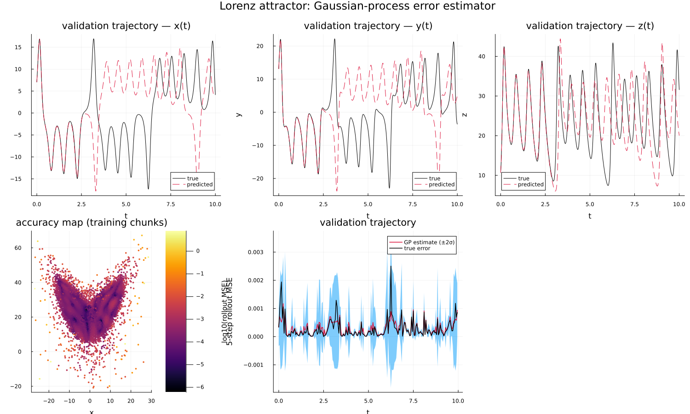

# Uncertainty Quantification

This document describes an uncertainty-quantification (UQ) layer data-driven surrogates of dynamical systems: a Gaussian process (GP) that predicts, **from the current state alone**, how large the trained neural model's own short-horizon rollout error is about to be. Instead of a single global accuracy number, this gives a *state-dependent* mean and variance, an "accuracy map" over the attractor.

## Contents

- [Motivation and setting](#motivation-and-setting)
- [Error quantification algorithms](#error-quantification-algorithms)
- [Scripts](#scripts)

## Motivation and setting

A learned vector field is never uniformly accurate: some regions of state space are better sampled or dynamically "easier" than others, so the model's short-horizon rollout error varies systematically with where the trajectory currently is. This UQ example makes that variation explicit and predictable:

1. Train the neural model exactly as in [Lorenz_NN_finitediff.jl](../scripts/ml/Lorenz_NN_finitediff.jl).
2. Split its training trajectories into non-overlapping chunks of $L = 5$ raw time steps; roll the trained model out over each chunk from its initial condition and score the mean squared error against the true continuation. This gives scattered samples $(x_{0,n}, e_n)$ pairing a state with the model's own rollout error there, the *accuracy map* data.
3. Fit a Gaussian process to these pairs, $e(x) \approx \mathrm{GP}(x)$, turning the discrete samples into a continuous mean/variance field.
4. On a held-out validation trajectory, compare the GP's predicted error (with its uncertainty band) against the *true* rollout error, computed the same way.

Because step 2 only calls the model's own `predict`, the same recipe works for any model sharing the `ODEModel`/`NeuralModel`/`ReducedModel` interface, not just the neural Lorenz predictor.

  

## Error quantification algorithms

### Rollout-error scoring

[RolloutError.jl](../algorithms/uq/RolloutError.jl) is model-agnostic: `rollout_steps` advances any `predict(θ, x, u, δt)`-compatible model for $L$ explicit-Euler steps from a state $x_0$, and `rollout_chunk_errors` applies it to every chunk of $L$ raw time steps in a set of trajectories (starting every `stride` steps, default $L$, i.e. non-overlapping chunks; a smaller stride gives a denser accuracy map when few trajectories are available, as in the PCB exercise below),

$$
\mathrm{mse}(x_{0}) = \frac{1}{L}\sum_{n=1}^{L} \big\lVert \tilde{x}^{n} - x^{s+n} \big\rVert^2,
\qquad x_0 = x^s,
$$

where $\tilde{x}$ is the model's own rollout from $x_0$ and $x^{s+1:s+L}$ the true continuation. It returns the chunk initial conditions `X0` (`nin × N`) alongside their errors `mse` (`N`) - one pair per chunk, ready to be regressed. Autonomous models pass a constant control `u` (the default, zero); DRIVEN models instead pass the full per-step, per-trajectory control trajectory `U` (`nctrl × T × ntraj`, aligned with the state ensemble), from which the $L$-step control window of every chunk is sliced automatically - used by the operator-inference exercise below, whose reduced model is driven by a recorded signal rather than autonomous.

### The Gaussian-process accuracy map

[GPErrorModel.jl](../algorithms/uq/GPErrorModel.jl) fits a Gaussian process $e(x) \approx \mathrm{GP}(x)$ to those pairs with `fit_error_gp(X0, mse)`, using a squared-exponential ARD kernel (one length scale per state component, initialised from the spread of `X0`) and a constant mean, with all hyperparameters (length scales, signal/noise variance) optimised by maximum likelihood (`GaussianProcesses.jl`). An exact GP's covariance matrix is dense and its fit costs $O(N^3)$, so whenever there are more than `max_points` chunks (default `1000`) `fit_error_gp` first randomly subsamples down to that many - rollout chunks routinely number in the tens of thousands, far beyond what a dense Cholesky factorisation can handle. `predict_error(gpmodel, X)` then returns the **mean** and **standard deviation** of the expected rollout error at any new states `X` - the continuous accuracy map queried pointwise. Because it wraps a plain `GP` object in `ErrorGPModel`, the fitted surrogate is reusable independently of how the training pairs were generated.

## Scripts

- [Lorenz_NN_GP-ErrorEstimator.jl](../scripts/uq/Lorenz_NN_GP-ErrorEstimator.jl): trains the neural model exactly as [Lorenz_NN_finitediff.jl](../scripts/ml/Lorenz_NN_finitediff.jl) does, builds the accuracy map from the **training** trajectories, fits the GP surrogate, and compares the true vs GP-estimated rollout error on a held-out **validation** trajectory, written to `results/uq/Lorenz_NN_GP-ErrorEstimator.png`.

- [PCB_OperatorInference_GPErrorEstimator.jl](../exercises/uq/PCB_OperatorInference_GPErrorEstimator.jl): applies the exact same two algorithms to a **driven** reduced-order model - the operator-inference ROM of [PCB_OperatorInference.jl](../scripts/rom/PCB_OperatorInference.jl), using `rollout_chunk_errors`'s `U` argument to thread each PCB simulation's own recorded drive through the rollout. See [uq_exercises.md](../exercises/uq_exercises.md#exercise-1--a-gaussian-process-error-estimator-for-the-operator-inference-rom) for the full write-up.

## References

1. Zhuang, Qinyu, et al. "[Active-learning-based nonintrusive model order reduction.](https://doi.org/10.1017/dce.2022.39)" *Data-Centric Engineering* 4 (2023): e2. 
2. Wang, Yan, Anh V. Tran, and David L. McDowell. [*Fundamentals of Uncertainty Quantification for Engineers: Methods and Models*](https://doi.org/10.1016/C2022-0-02115-2). Elsevier, 2025. 
3. Williams, Christopher KI, and Carl Edward Rasmussen. [*Gaussian processes for machine learning*](https://gaussianprocess.org/). MIT press, 2006. 
